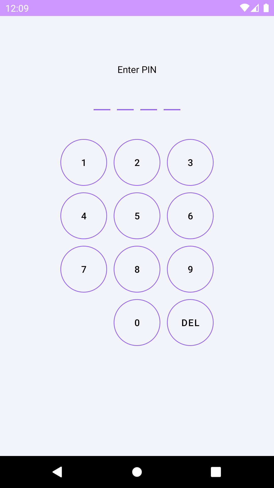
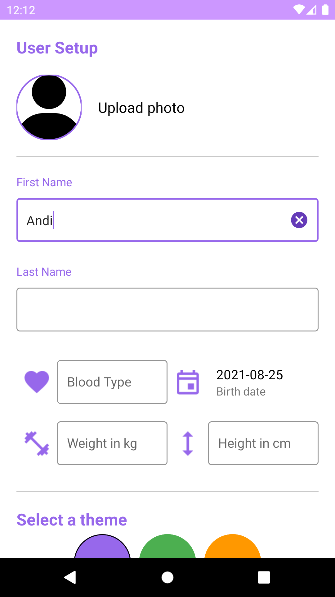
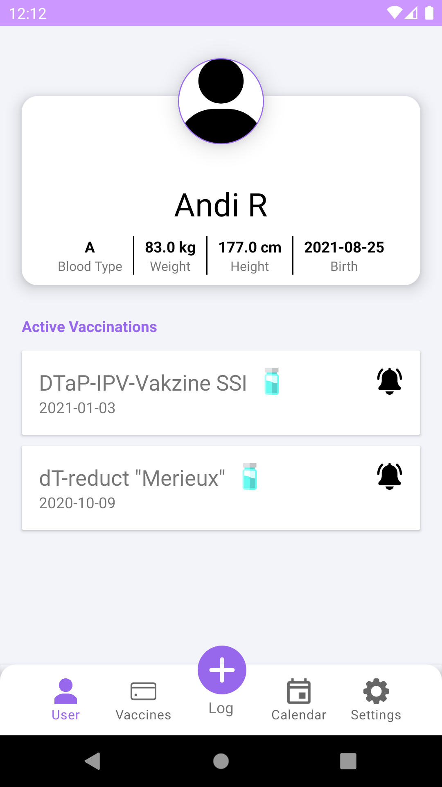
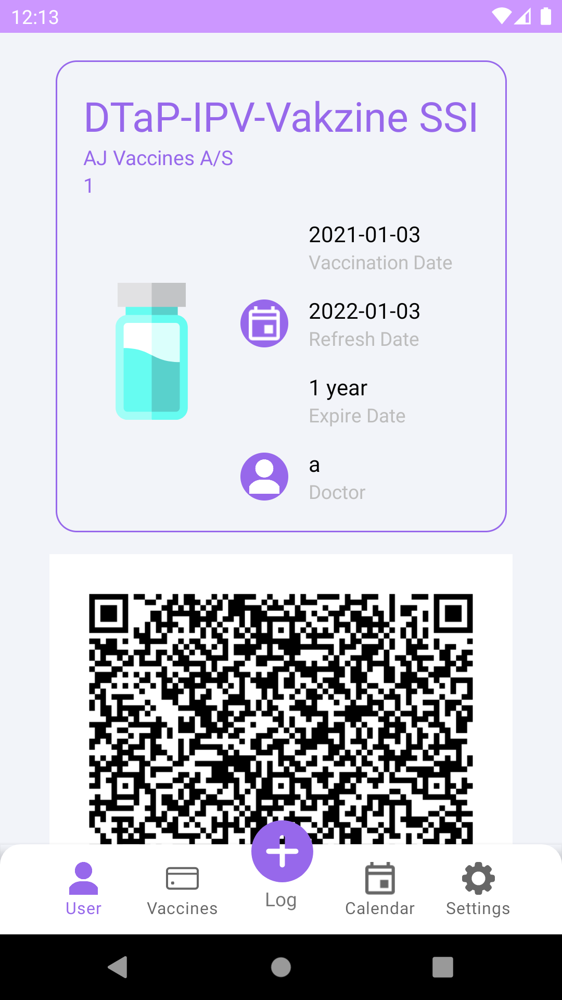
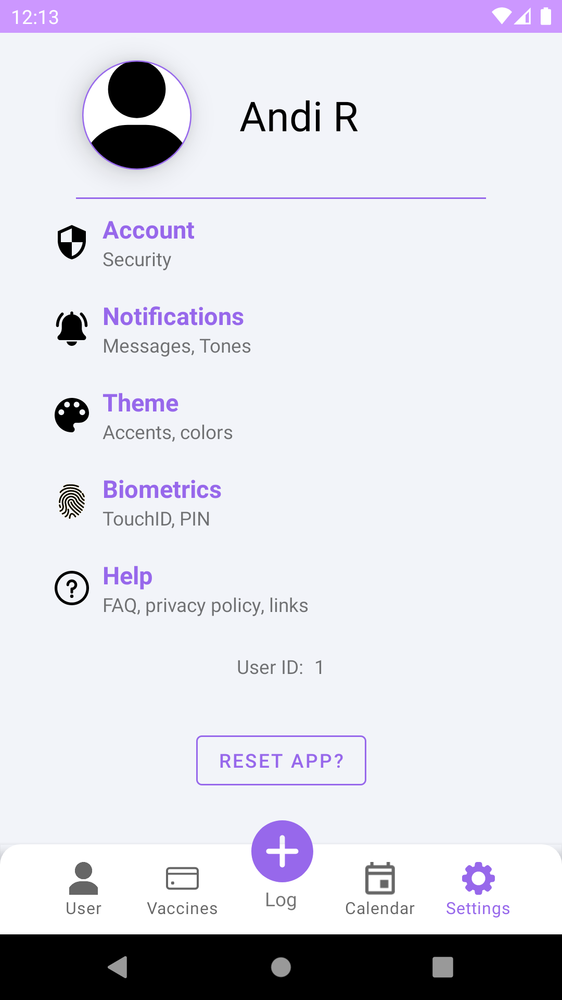

<h1 align="center">
  
   
  VaccinePass
   
  - Archived -

  
  
</h1>

# Preface

This project is archived and is for future reference only. Use code samples at your own risk.

## Overview

This project has been created as part of the Mobile Health and Sports course. The focus for this app and it's components is to show how vaccines and information can be stored in a mobile app while also allowing the user to show others that their vaccination is valid.

## Showcase Main App

Pin          |  Creation
:-------------------------:|:-------------------------:
  |  

Main          |  Vaccine
:-------------------------:|:-------------------------:
  |  

  

## Technology used

IDE:  
[Android Studio](https://developer.android.com/studio)  

Some awesome Android libraries we :heart: :  
[Koin](https://insert-koin.io/)  
[ReactiveX](http://reactivex.io/)  
[RxRelay](https://github.com/JakeWharton/RxRelay)  
[Timber](https://github.com/JakeWharton/timber)

Other tools/libraries:  
[NodeJS](https://nodejs.org/en/)  
[Docker](https://www.docker.com/)  
[PostgreSQL](https://www.postgresql.org/)
